# 👋 Hi, I'm Ashish

Welcome to my GitHub profile!

  

## 🚀 Top Skills

-  **Linux**: Passionate about open-source, customization, and efficient workflows.
-  **Docker**: Containerizing applications for reproducible and scalable deployments.
-  **Kubernetes**: Orchestrating, scaling, and automating container management.
-  **Terraform**: Infrastructure-as-code — provisioning and managing cloud resources with modules and state management.
-  **Ansible**: Configuration management and automation using playbooks, roles, and idempotent tasks.
-  **AWS**: Building and managing cloud infrastructure for modern applications.

## 📊 GitHub Stats

  
  

 
## 📦 Featured Repositories

- [dotfiles](https://github.com/ashd90/dotfiles) — My personal configuration files for Linux systems.
- [postarch](https://github.com/ashd90/postarch) - Personal Shell scripts for hyprland & other stuff

---

<!--
🌐 Contact: [GitHub](https://github.com/ashd90)
-->
